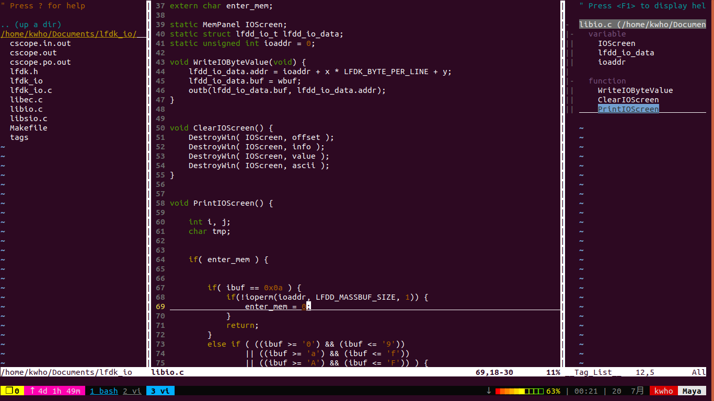

# vim-setting
My vim environment setting, shoule download taglist from [website](https://sourceforge.net/projects/vim-taglist/files/).
---
Go to root folder of your project and execute command.
```
$ ctags -R
$ cscope -Rbqk
```
---
Hot keys
```
F3 : open/close NERDTree (see the folder of project)
F4 : open/close taglist (see the functions of the file)
F5 : fine symbol (cscope)
F6 : fine string (cscope)
F7 : fine find function who used (cscope)
F1 : next resault
F2 : previous resault
ctrl + ] : go to function define
ctrl + t : go back
```
Command
```
:ClangFormat : format coding style
:CtrlP : find file
:CtrlPFunky : find function from the file
```
## Screenshot


